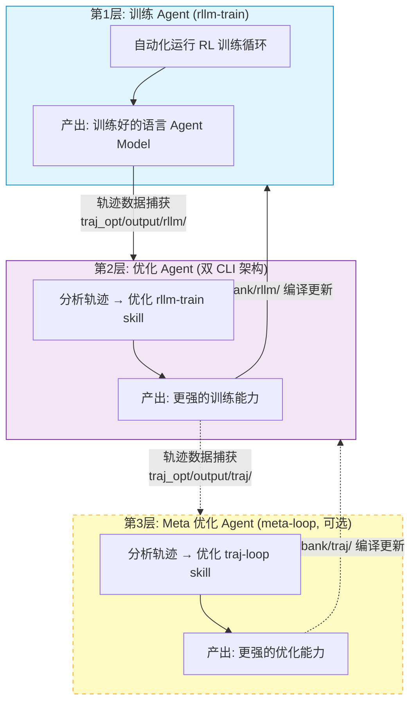
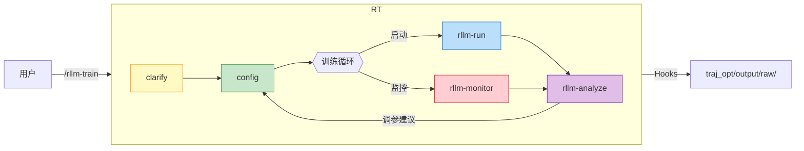
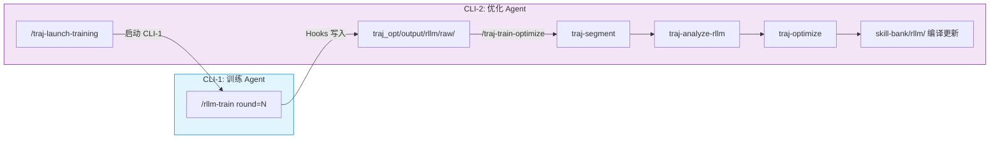

# agent-evolution

三层自演进 Agent 架构：Agent 自己训练自己，优化训练过程，并递归改进优化器本身。

本项目将 [rLLM](https://github.com/agentification/rllm) 的 agent/environment 抽象与 HuggingFace [TRL](https://github.com/huggingface/trl) 的 GRPOTrainer 结合，在 Mac 上用强化学习训练语言 agent，并通过轨迹捕获和 LLM 分析实现训练系统的持续自我优化。

## 核心理念：Agent 自己训练自己

本项目实现了**三层 Agent 自演进架构**，让语言 agent 和训练它的 skill 系统互相驱动、持续进化：



**核心创新**:
- **训练闭环**: rllm-train skill 自动驱动 RL 训练流程，自动捕获训练轨迹到 `traj_opt/output/rllm/`
- **优化闭环**: 双 CLI 架构（CLI-1 训练 + CLI-2 优化），基于轨迹数据自动分析、自动生成 skill 优化补丁
- **物理隔离**: 训练和优化在独立进程中执行，通过文件系统协调，确保分析基于客观轨迹而非内部状态
- **Layer 隔离**: 按 layer 隔离存储轨迹（rllm/traj/），防止分析器读到错误的输入数据
- **双重自动**: 训练自动执行，优化自动进行，模型和训练系统同步持续演进

## 快速开始

```bash
pip install torch transformers trl datasets
```

### 方式一：直接运行训练

```bash
python -m rllm_train.train "用 qwen-0.5b 训练数学 agent，64 个问题"
```

### 方式二：双 CLI 自动优化（推荐）

打开两个终端，分别运行 Claude Code：

```bash
# Terminal 1 & 2 都进入项目目录
cd /path/to/project

# Terminal 2 (优化 Agent)
claude

# 首次使用，初始化轨迹捕获
> /traj-setup

# 启动 Round 1 训练（自动打开 Terminal 1）
> /traj-launch-training round=1 | 用 qwen-0.5b 训练, reward >= 0.8

# Terminal 1 中 rllm-train 自动执行训练...
# 训练完成后回到 Terminal 2

# 分析轨迹，生成优化 patch
> /traj-train-optimize round=1

# 使用优化后的 skill 启动 Round 2
> /traj-launch-training round=2 | 用 qwen-0.5b 训练, reward >= 0.8
> /traj-train-optimize round=2
```

每轮优化后，rllm-xx skill 自动改进（参数安全范围、异常检测、监控策略等），下一轮训练使用更强的 skill。

## 双层 Agent 自演进系统

### 第一层：训练 Agent — rllm-train

驱动完整 RL 训练闭环的 Claude Code skill 系统：



**Skill 一览**:

| Skill | 职责 |
|---|---|
| `rllm-train` | 主编排，串联全流程，支持 auto/approve 两种执行模式 |
| `rllm-clarify` | 从自然语言中提取结构化训练需求（中英文） |
| `rllm-config` | 生成初始配置 / 根据分析结果自动调参 |
| `rllm-run` | 后台启动训练进程 |
| `rllm-monitor` | 实时监控训练进度，检测异常（loss 爆炸、OOM、进程崩溃） |
| `rllm-analyze` | 分析训练结果，生成调参建议（含决策树） |

**三种使用模式**:

| 模式 | 适用场景 | 命令示例 |
|------|---------|---------|
| 手动 | 单次训练，按步确认 | `/rllm-train approve 模式，qwen-0.5b，64 题` |
| 自动 | 快速测试，持续调参重训 | `/rllm-train auto 模式，16 题，reward >= 0.5` |
| 优化 | 多轮自动优化 skill | `/traj-loop 用 qwen-0.5b 自动优化 3 轮` |

### 第二层：优化 Agent — 双 CLI 架构

基于轨迹捕获和 LLM 分析的自动化 skill 优化系统。它不直接训练模型，而是通过分析 rllm-train 执行轨迹来优化 rllm-train 本身。

训练和优化在两个独立的 Claude Code 进程中执行，通过文件系统协调：



**Skill 一览**:

| Skill | 职责 |
|---|---|
| `traj-launch-training` | 在 CLI-2 中启动新 CLI-1 进程执行训练 |
| `traj-train-optimize` | CLI-2 编排：分割 → 分析 → 优化完整流程 |
| `traj-segment` | 将原始事件流分割为结构化轨迹 |
| `traj-analyze-rllm` | LLM 分析 Layer 1 (rllm) 训练轨迹，识别问题模式，生成优化建议 |
| `traj-optimize` | 将分析报告转化为 skill-bank patch，人工确认后编译 |
| `traj-setup` | 一次性环境配置（hooks 安装） |
| `traj-status` | 查看轮次状态和轨迹数据概览 |

**使用流程**:

```bash
# CLI-2 中操作
/traj-launch-training round=1 | 用 qwen-0.5b 训练, reward >= 0.8
# → 新终端窗口打开 CLI-1，用户在其中交互式训练
# → 训练完成后回到 CLI-2
/traj-train-optimize round=1
# → 分割 → 分析 → 生成 patch → 确认 → 编译
/traj-launch-training round=2 | 用 qwen-0.5b 训练, reward >= 0.8
# → 使用优化后的 skill 训练
```

### 第三层：Meta 优化 Agent（可选，实验性）

meta-loop 分析 traj-loop 的执行轨迹，优化 traj-loop 本身，实现递归自演进。

**优化模式**:

| 模式 | 说明 | 命令示例 |
|------|------|---------|
| 手动 | 逐步执行，每步确认 | `/rllm-train` + `/traj-train-optimize` |
| 半自动 | CLI-2 一键启动训练和优化 | `/traj-launch-training` + `/traj-train-optimize` |
| 全自动 | 多轮连续执行（实验性） | `/traj-loop qwen-0.5b，3 轮，auto` |

### 自演进流程示例

```
Round 1:
  CLI-2: /traj-launch-training round=1 | 用 qwen-0.5b 训练, reward >= 0.8
  CLI-1: rllm-train 执行 → reward=0.86 → 轨迹捕获
  CLI-2: /traj-train-optimize round=1
    → 分析发现: loss=0 说明题目太简单，session_id 获取失败
    → 生成 3 个 patch: 难度自动升级、session_id 修复、监控频率

Round 2: 使用优化后的 skill
  CLI-2: /traj-launch-training round=2 | ...
  CLI-1: rllm-train 执行 → reward=0.825 → session_id 正确获取
  CLI-2: /traj-train-optimize round=2
    → 验证: session_id 修复已生效
    → 后半段 reward 轻微波动，单轮不调参

结果: 2 轮优化后，3 个 patch 被接受，skill 持续自我改进
```

## 训练管线工作原理

```
train.py → GRPOTrainer → rollout_func → HFAgentExecutionEngine → agent/env 循环
```

每个训练步骤：
1. GRPOTrainer 调用自定义 rollout 函数
2. `HFAgentExecutionEngine` 用 `model.generate()` 运行 agent-environment 循环
3. `ToolAgent` 解析工具调用，`MathCalcEnv` 执行并返回观测
4. 逐 token 响应掩码（1=模型，0=环境）确保只有模型 token 参与梯度更新
5. 轨迹、奖励、掩码回传给 GRPOTrainer 进行策略更新

## 模块结构

### rllm_train（训练后端）

| 模块 | 职责 |
|---|---|
| `train.py` | 入口，构建数据集、模型、tokenizer，接入 GRPOTrainer |
| `config.py` | `TrainingConfig` + 自然语言解析器（中英文） |
| `rollout.py` | TRL 与 rLLM 风格 agent 执行的桥梁 |
| `hf_engine.py` | agent-env 循环执行引擎，管理 token 掩码 |
| `base.py` | 核心抽象：`BaseAgent`、`BaseEnv`、`Trajectory`、`ToolCall` |
| `tool_agent.py` | 对话管理、工具调用解析 |
| `math_env.py` | 计算器环境，算术题目生成 |
| `parsers.py` | 聊天模板 + 工具调用解析，token 级掩码生成 |
| `logger.py` | 训练实时进度表和总结报告 |
| `perf_stats.py` | 耗时分解：推理、环境、logprob、GRPO |
| `trajectory_writer.py` | 逐步 JSONL 输出 |

### traj_opt（优化后端）

| 模块 | 职责 |
|---|---|
| `hooks/` | Claude Code hooks 入口（PostToolUse、Stop、SubagentStop） |
| `adapter/` | Hooks JSON → 内部格式转换（唯一的 schema 耦合点） |
| `store/` | 事件写入、轨迹查询、索引管理 |
| `segmenter/` | 轨迹分割（Skill Segmenter + Free Segmenter） |
| `analyzer/` | 分析基础设施（轨迹读取、训练数据提取、报告生成） |
| `optimizer/` | PatchGenerator（生成 + 校验 + 激活）、CompilerBridge |
| `round_state.py` | 轮次协调（status.json 读写） |
| `config.py` | TrajectoryConfig |

## 关键设计

**响应掩码**：掩码系统（1=模型 token，0=环境 token）是 GRPO 训练正确性的核心。环境注入的 token 不参与梯度计算，由 `parsers.py` 中的 `convert_messages_to_tokens_and_masks()` 实现。

**最小抽象**：不依赖完整 rLLM 框架，只内联 `BaseAgent`、`BaseEnv`、`Step`、`Trajectory`，保持依赖轻量。

**Skill 解耦**：每个 skill 可独立调用（如 `/rllm-analyze` 单独分析上次训练），也可由主编排串联成完整闭环。

## Skill Bank

Skill 通过 `skill-bank/` 目录管理，采用 base + patch + compile 架构。不要直接编辑 `.claude/skills/*/SKILL.md`，而是修改 base 或添加 patch，然后编译。

```bash
# 编译单个 skill
python skill-bank/compile.py rllm-config

# 编译整个 group
python skill-bank/compile.py --group rllm

# 编译所有 skill
python skill-bank/compile.py --all

# 查看 patch 状态
python skill-bank/compile.py --status

# 预览变更
python skill-bank/compile.py --diff rllm-config
```

每个 skill 的结构：`skill-bank/<group>/<skill>/base.md`（带 section 锚点）、`patches/*.md`、`manifest.yaml`。详见 `docs/skill-bank-design.md`。

## 设计文档

- `docs/system-overview.md` — 系统总览：四层架构、双 CLI 架构、隔离设计、轮次协调协议
- `docs/rllm-train-design.md` — rllm_train 训练后端技术规范
- `docs/traj-opt-design.md` — traj_opt 优化后端技术规范
- `docs/skills-design.md` — 两组 skill 的职责划分、编排逻辑、使用场景
- `docs/skill-bank-design.md` — Skill Bank 架构规范（base + patch + compile）
- `docs/rllm-skill-changelog.md` — rllm skill 系统演进记录

## License

MIT